# Database Design Master - Nexus ERP

## Stato documento
Documento di progettazione database definitivo per Nexus ERP. Non rappresenta una migrazione eseguita e non modifica lo schema reale. Ogni implementazione dovra' essere trasformata in migrazioni controllate, testate e documentate.

## 1. Principio generale
Il cuore del sistema e' il Fascicolo universale. Ogni processo operativo deve potersi collegare a un fascicolo, anche quando nasce da un modulo verticale.

Tabelle centrali del Fascicolo universale:
- `cases`
- `case_subjects`
- `case_documents`
- `case_tasks`
- `case_deadlines`
- `case_timeline`
- `case_workflows`
- `case_notes`

Ogni modulo usa il fascicolo:
- mediazione;
- formazione;
- OCC;
- orientamento;
- crisi impresa;
- advisor.

Il fascicolo deve contenere soggetti, documenti, scadenze, attivita', note, eventi, workflow e collegamenti ai dati verticali. Le tabelle verticali non devono duplicare il fascicolo: devono specializzarlo.

## 2. Multi-organismo e campi standard
Ogni tabella principale deve prevedere:
- `organization_id`
- `office_id`, se applicabile;
- `created_at`
- `updated_at`
- `created_by`
- `updated_by`
- `deleted_at`

Regole:
- `organization_id` e' obbligatorio sulle tabelle operative e di configurazione legate a un organismo.
- `office_id` e' obbligatorio solo quando il dato appartiene a una sede specifica.
- `deleted_at` abilita soft delete e conservazione storica.
- `created_by` e `updated_by` puntano a `users.id` quando l'operazione e' umana; per job o integrazioni si usa un utente tecnico o un campo di contesto nei log.

Campi standard consigliati:

| Campo | Tipo logico | Note |
| --- | --- | --- |
| `id` | UUID o big integer | Chiave primaria stabile. |
| `organization_id` | FK | Collegamento a `organizations.id`. |
| `office_id` | FK nullable | Collegamento a `offices.id`, se applicabile. |
| `created_at` | timestamp | Data creazione. |
| `updated_at` | timestamp | Data ultima modifica. |
| `created_by` | FK nullable | Utente creatore. |
| `updated_by` | FK nullable | Utente ultima modifica. |
| `deleted_at` | timestamp nullable | Soft delete. |

## 3. Modello concettuale
Nexus ERP e' composto da:
- Core Platform: identita', organizzazioni, sedi, ruoli, permessi, moduli, impostazioni e audit.
- CRM: anagrafiche persone, aziende, recapiti, ruoli, relazioni e profili professionali.
- Case Engine: fascicolo universale e oggetti operativi collegati.
- Mediazione: specializzazione del fascicolo per procedimenti di mediazione.
- Mediator Governance: nomine, accettazioni, imparzialita', aggiornamenti e compliance.
- Notification Engine: notifiche, email, destinatari, allegati e template.
- Signature Engine: richieste firma, destinatari, documenti, eventi e versioni.
- Preservation Engine: predisposizione conservazione a norma CAD.
- Document Engine: template, documenti generati, versioni, metadati, storage e link.
- Economic Engine: tariffari, regole, calcoli, pagamenti, compensi e retrocessioni.
- Parser & AI: parser, risultati, campi estratti, agenti, prompt, log e suggerimenti.

## 4. Modello logico

```mermaid
erDiagram
    organizations ||--o{ offices : owns
    organizations ||--o{ users : owns
    users }o--o{ roles : through_user_roles
    roles }o--o{ permissions : through_role_permissions
    organizations ||--o{ organization_modules : enables
    modules ||--o{ organization_modules : configured

    organizations ||--o{ contacts : owns
    contacts ||--o{ contact_emails : has
    contacts ||--o{ contact_pec : has
    contacts ||--o{ contact_phones : has
    contacts ||--o{ contact_addresses : has
    contacts }o--o{ contact_roles : assigned
    contacts ||--o{ professional_profiles : qualifies
    companies ||--o{ contacts : employs

    organizations ||--o{ cases : owns
    cases ||--o{ case_subjects : includes
    cases ||--o{ case_documents : includes
    cases ||--o{ case_tasks : tracks
    cases ||--o{ case_deadlines : schedules
    cases ||--o{ case_timeline : records
    cases ||--o{ case_workflows : follows
    cases ||--o{ case_notes : annotates

    cases ||--o{ mediation_cases : specializes
    mediation_cases ||--o{ mediation_parties : includes
    mediation_cases ||--o{ mediation_lawyers : includes
    mediation_cases ||--o{ mediation_mediators : includes
    mediation_cases ||--o{ mediation_sessions : schedules
    mediation_cases ||--o{ mediator_assignments : assigns

    generated_documents ||--o{ document_versions : versions
    generated_documents ||--o{ signature_documents : signed_as
    generated_documents ||--o{ preservation_documents : preserved_as
    signature_requests ||--o{ signature_request_recipients : sends_to
    signature_requests ||--o{ signature_documents : contains
    preservation_packages ||--o{ preservation_documents : contains
```

## 5. Tabelle CORE

### `organizations`
Descrizione: organismi o tenant logici della piattaforma.

Campi principali:
- `id` PK
- `name`
- `legal_name`
- `tax_code`
- `vat_number`
- `status`
- `settings_json`
- campi standard audit

Relazioni:
- 1:N con `offices`, `users`, `contacts`, `cases`, `organization_modules`.

Indici:
- unique su `tax_code`, se presente;
- indice su `status`;
- indice su `deleted_at`.

Vincoli:
- `name` obbligatorio;
- `status` in valori controllati: active, suspended, archived.

### `offices`
Descrizione: sedi operative o amministrative.

Campi principali:
- `id` PK
- `organization_id` FK
- `name`
- `code`
- `address`
- `city`
- `province`
- `country`
- `status`
- campi standard audit

Relazioni:
- N:1 con `organizations`;
- 1:N con utenti, fascicoli, procedimenti e configurazioni localizzate.

Indici:
- unique composto `organization_id, code`;
- indice su `organization_id, status`.

### `users`
Descrizione: utenti applicativi.

Campi principali:
- `id` PK
- `organization_id` FK nullable per utenti platform-level
- `office_id` FK nullable
- `email`
- `display_name`
- `password_hash` o riferimento identity esterna
- `status`
- `last_login_at`
- campi standard audit

Relazioni:
- N:M con `roles` tramite `user_roles`;
- 1:N con log, documenti, task e azioni.

Indici:
- unique su `email`;
- indice su `organization_id, office_id`;
- indice su `status`.

### `roles`
Descrizione: ruoli applicativi.

Campi principali:
- `id` PK
- `organization_id` FK nullable
- `name`
- `code`
- `description`
- `scope`
- campi standard audit

Relazioni:
- N:M con `permissions`;
- N:M con `users`.

Indici:
- unique composto `organization_id, code`.

### `permissions`
Descrizione: permessi atomici.

Campi principali:
- `id` PK
- `code`
- `name`
- `module_code`
- `description`

Indici:
- unique su `code`;
- indice su `module_code`.

### `role_permissions`
Descrizione: associazione ruoli-permessi.

Campi principali:
- `role_id` FK
- `permission_id` FK
- `created_at`
- `created_by`

Chiave primaria:
- PK composta `role_id, permission_id`.

Indici:
- indice su `permission_id`.

### `user_roles`
Descrizione: associazione utenti-ruoli.

Campi principali:
- `user_id` FK
- `role_id` FK
- `organization_id` FK nullable
- `office_id` FK nullable
- `valid_from`
- `valid_to`
- `created_at`
- `created_by`

Chiave primaria:
- PK composta o id dedicato con unique su `user_id, role_id, organization_id, office_id`.

### `audit_logs`
Descrizione: registro eventi applicativi.

Campi principali:
- `id` PK
- `organization_id` FK nullable
- `office_id` FK nullable
- `user_id` FK nullable
- `event_type`
- `entity_name`
- `entity_id`
- `before_json`
- `after_json`
- `ip_address`
- `user_agent`
- `created_at`

Indici:
- `organization_id, created_at`;
- `entity_name, entity_id`;
- `user_id, created_at`;
- `event_type`.

### `system_settings`
Descrizione: impostazioni di sistema o organismo.

Campi principali:
- `id` PK
- `organization_id` FK nullable
- `office_id` FK nullable
- `key`
- `value_json`
- `value_type`
- `is_secret`
- campi standard audit

Vincoli:
- unique composto `organization_id, office_id, key`.

### `modules`
Descrizione: catalogo moduli prodotto.

Campi principali:
- `id` PK
- `code`
- `name`
- `description`
- `category`
- `is_core`
- `status`

Indici:
- unique su `code`.

### `organization_modules`
Descrizione: moduli attivi per organismo.

Campi principali:
- `id` PK
- `organization_id` FK
- `module_id` FK
- `enabled`
- `configuration_json`
- campi standard audit

Vincoli:
- unique composto `organization_id, module_id`.

## 6. Tabelle CRM

### `contacts`
Descrizione: anagrafica persone fisiche o riferimenti professionali.

Campi principali:
- `id` PK
- `organization_id` FK
- `office_id` FK nullable
- `contact_type`
- `first_name`
- `last_name`
- `display_name`
- `tax_code`
- `vat_number`
- `birth_date`
- `birth_place`
- `status`
- campi standard audit

Indici:
- `organization_id, last_name, first_name`;
- `tax_code`;
- `status`;
- full-text su `display_name`.

### `contact_roles`
Descrizione: ruoli ricoperti da un contatto.

Campi principali:
- `id` PK
- `organization_id` FK
- `contact_id` FK
- `role_code`
- `module_code`
- `valid_from`
- `valid_to`
- campi standard audit

Vincoli:
- unique consigliato su `contact_id, role_code, module_code, valid_from`.

### `contact_addresses`
Descrizione: indirizzi fisici.

Campi principali:
- `id` PK
- `organization_id` FK
- `contact_id` FK nullable
- `company_id` FK nullable
- `address_type`
- `street`
- `city`
- `province`
- `postal_code`
- `country`
- `is_primary`
- campi standard audit

### `contact_emails`
Descrizione: indirizzi email ordinari.

Campi principali:
- `id` PK
- `organization_id` FK
- `contact_id` FK
- `email`
- `is_primary`
- `verified_at`
- campi standard audit

Indici:
- `email`;
- `contact_id, is_primary`.

### `contact_pec`
Descrizione: indirizzi PEC.

Campi principali:
- `id` PK
- `organization_id` FK
- `contact_id` FK nullable
- `company_id` FK nullable
- `pec_address`
- `is_primary`
- `verified_at`
- campi standard audit

Indici:
- unique consigliato su `organization_id, pec_address`.

### `contact_phones`
Descrizione: telefoni e cellulari.

Campi principali:
- `id` PK
- `organization_id` FK
- `contact_id` FK
- `phone_type`
- `phone_number`
- `is_primary`
- campi standard audit

### `companies`
Descrizione: aziende, enti, studi professionali o soggetti giuridici.

Campi principali:
- `id` PK
- `organization_id` FK
- `office_id` FK nullable
- `name`
- `legal_name`
- `tax_code`
- `vat_number`
- `company_type`
- `status`
- campi standard audit

Indici:
- `organization_id, name`;
- `vat_number`;
- `tax_code`.

### `contact_relationships`
Descrizione: relazioni tra contatti e aziende o tra contatti.

Campi principali:
- `id` PK
- `organization_id` FK
- `source_contact_id` FK nullable
- `target_contact_id` FK nullable
- `company_id` FK nullable
- `relationship_type`
- `valid_from`
- `valid_to`
- campi standard audit

### `professional_profiles`
Descrizione: profili professionali, abilitazioni e dati qualificanti.

Campi principali:
- `id` PK
- `organization_id` FK
- `contact_id` FK
- `profile_type`
- `registration_number`
- `professional_order`
- `qualification_json`
- `status`
- campi standard audit

Indici:
- `contact_id, profile_type`;
- `organization_id, status`.

## 7. Fascicolo universale

### `cases`
Descrizione: fascicolo universale.

Campi principali:
- `id` PK
- `organization_id` FK
- `office_id` FK nullable
- `case_number`
- `case_type`
- `title`
- `description`
- `status`
- `opened_at`
- `closed_at`
- `archived_at`
- `owner_user_id` FK
- campi standard audit

Indici:
- unique composto `organization_id, case_number`;
- `organization_id, office_id, status`;
- `case_type`;
- full-text su `title, description`.

### `case_subjects`
Descrizione: soggetti collegati al fascicolo.

Campi principali:
- `id` PK
- `case_id` FK
- `contact_id` FK nullable
- `company_id` FK nullable
- `subject_role`
- `is_primary`
- campi standard audit

Indici:
- `case_id, subject_role`;
- `contact_id`;
- `company_id`.

### `case_documents`
Descrizione: documenti collegati al fascicolo.

Campi principali:
- `id` PK
- `case_id` FK
- `document_id` FK verso `generated_documents` o archivio documentale
- `document_role`
- `visibility`
- campi standard audit

### `case_tasks`
Descrizione: attivita' operative.

Campi principali:
- `id` PK
- `case_id` FK
- `assigned_to_user_id` FK nullable
- `title`
- `description`
- `status`
- `priority`
- `due_at`
- campi standard audit

Indici:
- `assigned_to_user_id, status, due_at`;
- `case_id, status`.

### `case_deadlines`
Descrizione: scadenze del fascicolo.

Campi principali:
- `id` PK
- `case_id` FK
- `deadline_type`
- `title`
- `due_at`
- `completed_at`
- `status`
- campi standard audit

Indici:
- `organization_id, due_at, status`;
- `case_id, due_at`.

### `case_timeline`
Descrizione: eventi cronologici del fascicolo.

Campi principali:
- `id` PK
- `case_id` FK
- `event_type`
- `event_title`
- `event_description`
- `event_at`
- `actor_user_id` FK nullable
- `metadata_json`
- campi standard audit

Indici:
- `case_id, event_at`;
- `event_type`.

### `case_workflows`
Descrizione: istanze workflow collegate al fascicolo.

Campi principali:
- `id` PK
- `case_id` FK
- `workflow_code`
- `current_step`
- `status`
- `started_at`
- `completed_at`
- `metadata_json`
- campi standard audit

### `case_notes`
Descrizione: note interne o condivise.

Campi principali:
- `id` PK
- `case_id` FK
- `author_user_id` FK
- `note_type`
- `content`
- `visibility`
- campi standard audit

## 8. Tabelle MEDIAZIONE

### `mediation_cases`
Descrizione: specializzazione del fascicolo per mediazione.

Campi principali:
- `id` PK
- `organization_id` FK
- `office_id` FK
- `case_id` FK unique
- `mediation_number`
- `matter`
- `claim_value`
- `filing_date`
- `status`
- campi standard audit

Indici:
- unique composto `organization_id, mediation_number`;
- `case_id`;
- `status, filing_date`.

### `mediation_data`
Descrizione: dati estesi del procedimento.

Campi principali:
- `id` PK
- `mediation_id` FK
- `jurisdiction`
- `mandatory_mediation`
- `online_enabled`
- `language`
- `metadata_json`
- campi standard audit

### `mediation_parties`
Descrizione: parti del procedimento.

Campi principali:
- `id` PK
- `mediation_id` FK
- `contact_id` FK nullable
- `company_id` FK nullable
- `party_type`
- `is_applicant`
- `is_invited`
- campi standard audit

Indici:
- `mediation_id, party_type`;
- `contact_id`;
- `company_id`.

### `mediation_lawyers`
Descrizione: avvocati collegati alle parti.

Campi principali:
- `id` PK
- `mediation_id` FK
- `party_id` FK nullable
- `lawyer_contact_id` FK
- `representation_type`
- campi standard audit

### `mediation_mediators`
Descrizione: mediatori collegati al procedimento.

Campi principali:
- `id` PK
- `mediation_id` FK
- `mediator_contact_id` FK
- `role`
- `status`
- campi standard audit

### `mediation_sessions`
Descrizione: incontri di mediazione.

Campi principali:
- `id` PK
- `mediation_id` FK
- `session_number`
- `scheduled_at`
- `location`
- `online_link`
- `status`
- `minutes_document_id` FK nullable
- campi standard audit

Indici:
- `mediation_id, scheduled_at`;
- `status, scheduled_at`.

### `mediation_outcomes`
Descrizione: esiti del procedimento o degli incontri.

Campi principali:
- `id` PK
- `mediation_id` FK
- `outcome_type`
- `outcome_date`
- `agreement_document_id` FK nullable
- `notes`
- campi standard audit

### `mediation_dgstat`
Descrizione: dati predisposti per DGStat.

Campi principali:
- `id` PK
- `mediation_id` FK
- `period`
- `payload_json`
- `validation_status`
- `exported_at`
- campi standard audit

### `mediation_statistics`
Descrizione: statistiche aggregate o calcolate.

Campi principali:
- `id` PK
- `organization_id` FK
- `office_id` FK nullable
- `period`
- `metric_code`
- `metric_value`
- `metadata_json`
- campi standard audit

Indici:
- `organization_id, office_id, period, metric_code`.

## 8-bis. Telemediation Engine

### `telemediation_meetings`
Descrizione: incontri telematici o misti collegati a una mediazione e, se presente, a una sessione di mediazione.

Campi principali:
- `id` PK
- `organization_id` FK
- `mediation_id` FK verso `mediation_cases.id`
- `session_id` FK nullable verso `mediation_sessions.id`
- `provider`
- `webex_meeting_id`
- `webex_join_url`
- `meeting_date`
- `start_time`
- `end_time`
- `mode`
- `status`
- `created_at`
- `updated_at`

Relazioni:
- N:1 con `mediation_cases`;
- N:1 opzionale con `mediation_sessions`;
- 1:N con `telemediation_participants`.

Indici:
- `organization_id, mediation_id`;
- `session_id`;
- `provider, webex_meeting_id`;
- `meeting_date, status`;
- `mode`.

Vincoli:
- `provider` in valori controllati: WEBEX, TEAMS, ZOOM, GOOGLE_MEET;
- `mode` in valori controllati: presenza, telematica, mista;
- `status` in valori controllati: draft, scheduled, link_generated, completed, cancelled, sync_pending, sync_error.

### `telemediation_participants`
Descrizione: partecipanti a un incontro telematico o misto.

Campi principali:
- `id` PK
- `meeting_id` FK verso `telemediation_meetings.id`
- `contact_id` FK nullable verso `contacts.id`
- `role`
- `participation_mode`
- `email`
- `pec`
- `joined_at`
- `left_at`
- `presence_confirmed`
- `signature_mode`
- `notes`

Relazioni:
- N:1 con `telemediation_meetings`;
- N:1 opzionale con `contacts`;
- 1:N con `remote_consent_records`.

Indici:
- `meeting_id, role`;
- `contact_id`;
- `participation_mode`;
- `presence_confirmed`.

Vincoli:
- `participation_mode` in valori controllati: presenza, remoto;
- `signature_mode` in valori controllati: digitale, analogica, non_applicabile;
- almeno uno tra `contact_id`, `email` o `pec` deve essere valorizzato.

### `remote_consent_records`
Descrizione: registrazioni del consenso o mancato consenso alla partecipazione remota e alla firma digitale.

Campi principali:
- `id` PK
- `mediation_id` FK verso `mediation_cases.id`
- `participant_id` FK verso `telemediation_participants.id`
- `consent_type`
- `consent_given`
- `consent_date`
- `evidence_document_id` FK nullable verso `generated_documents.id`
- `notes`

Relazioni:
- N:1 con `mediation_cases`;
- N:1 con `telemediation_participants`;
- N:1 opzionale con `generated_documents`.

Indici:
- `mediation_id, consent_type`;
- `participant_id`;
- `consent_given, consent_date`.

Vincoli:
- `consent_type` in valori controllati: remote_participation, digital_signature, privacy, recording_notice;
- `consent_date` obbligatoria quando `consent_given` e' true.

### `signature_workflows`
Descrizione: workflow di firma documentale collegato a una mediazione e a un documento.

Campi principali:
- `id` PK
- `mediation_id` FK verso `mediation_cases.id`
- `document_id` FK verso `generated_documents.id`
- `workflow_type`
- `status`
- `created_at`
- `completed_at`

Relazioni:
- N:1 con `mediation_cases`;
- N:1 con `generated_documents`;
- 1:N con `signature_workflow_steps`.

Indici:
- `mediation_id, status`;
- `document_id`;
- `workflow_type, status`.

Vincoli:
- `workflow_type` in valori controllati: art_8_bis_digital, art_8_ter_mixed, mediator_final_signature, secretary_deposit;
- `status` in valori controllati: draft, sent, partially_signed, completed, refused, expired, cancelled.

### `signature_workflow_steps`
Descrizione: step individuali del workflow di firma.

Campi principali:
- `id` PK
- `workflow_id` FK verso `signature_workflows.id`
- `signer_contact_id` FK nullable verso `contacts.id`
- `signer_role`
- `step_order`
- `status`
- `sent_at`
- `signed_at`
- `refused_at`
- `signature_provider`
- `signature_evidence`

Relazioni:
- N:1 con `signature_workflows`;
- N:1 opzionale con `contacts`.

Indici:
- `workflow_id, step_order`;
- `signer_contact_id`;
- `status, sent_at`.

Vincoli:
- `signer_role` in valori controllati: mediatore, parte_istante, parte_invitata, avvocato_istante, avvocato_invitato, segreteria, responsabile_organismo;
- `status` in valori controllati: pending, sent, signed, refused, skipped, expired;
- `signed_at` valorizzato solo per step firmati;
- `refused_at` valorizzato solo per step rifiutati.

### `cad_preservation_records`
Descrizione: predisposizione di conservazione CAD per documenti di mediazione telematica o mista.

Campi principali:
- `id` PK
- `document_id` FK verso `generated_documents.id`
- `mediation_id` FK verso `mediation_cases.id`
- `provider`
- `status`
- `sent_at`
- `preserved_at`
- `receipt_file_path`
- `document_hash`
- `hash_algorithm`
- `metadata_json`

Relazioni:
- N:1 con `generated_documents`;
- N:1 con `mediation_cases`;
- 1:N con `preservation_events`, quando il record viene gestito dal Preservation Engine.

Indici:
- `document_id`;
- `mediation_id, status`;
- `provider, status`;
- `document_hash`.

Vincoli:
- `hash_algorithm` obbligatorio quando `document_hash` e' valorizzato;
- `status` in valori controllati: draft, ready, sent, preserved, failed, cancelled;
- `provider` nullable finche' non viene selezionato un conservatore accreditato.

Note:
- queste tabelle sono progettuali e non implementano ancora Webex API reali, firma digitale reale o conservazione reale;
- il provider iniziale e' Webex tramite layer astratto;
- `cad_preservation_records` rappresenta la vista operativa per documenti di mediazione;
- `preservation_providers` e `preservation_events` governano il layer provider e il ciclo eventi;
- le tabelle devono essere armonizzate con `signature_requests`, `signature_documents` e `preservation_documents` quando il Signature Engine e il Preservation Engine saranno consolidati.

## 9. Nomina Mediatore

### `mediator_assignments`
Descrizione: nomine del mediatore per procedimento.

Campi principali obbligatori:
- `id` PK
- `organization_id` FK
- `office_id` FK nullable
- `mediation_id` FK
- `mediator_contact_id` FK
- `assignment_date`
- `acceptance_deadline`
- `email_sent_at`
- `accepted_at`
- `refused_at`
- `status`
- `generated_documents` JSON o relazione documentale
- `signed_documents` JSON o relazione documentale
- campi standard audit

Relazioni:
- N:1 con `mediation_cases`;
- N:1 con `contacts` per il mediatore;
- 1:N con documenti di accettazione e imparzialita'.

Indici:
- `mediation_id`;
- `mediator_contact_id, status`;
- `acceptance_deadline, status`.

### `mediator_assignment_status`
Descrizione: storico stati della nomina.

Campi principali:
- `id` PK
- `assignment_id` FK
- `status`
- `status_at`
- `reason`
- `actor_user_id` FK nullable
- `metadata_json`

Indici:
- `assignment_id, status_at`.

### `mediator_acceptance_documents`
Descrizione: documenti di assunzione incarico.

Campi principali:
- `id` PK
- `assignment_id` FK
- `generated_document_id` FK
- `signature_request_id` FK nullable
- `status`
- campi standard audit

### `mediator_impartiality_documents`
Descrizione: dichiarazioni di imparzialita'.

Campi principali:
- `id` PK
- `assignment_id` FK
- `generated_document_id` FK
- `signature_request_id` FK nullable
- `status`
- campi standard audit

Vincoli:
- una nomina attiva per mediatore e procedimento, salvo regola esplicita di sostituzione.

## 10. Email al Mediatore e notifiche

### `notifications`
Descrizione: notifiche applicative interne o multicanale.

Campi principali:
- `id` PK
- `organization_id` FK
- `office_id` FK nullable
- `notification_type`
- `recipient_user_id` FK nullable
- `recipient_contact_id` FK nullable
- `subject`
- `body`
- `status`
- `scheduled_at`
- `sent_at`
- `read_at`
- `metadata_json`
- campi standard audit

Indici:
- `recipient_user_id, status`;
- `recipient_contact_id, status`;
- `scheduled_at, status`.

### `email_messages`
Descrizione: messaggi email generati o inviati.

Campi principali:
- `id` PK
- `organization_id` FK
- `office_id` FK nullable
- `template_id` FK nullable
- `related_entity_name`
- `related_entity_id`
- `subject`
- `body_html`
- `body_text`
- `status`
- `sent_at`
- `provider_message_id`
- campi standard audit

Indici:
- `related_entity_name, related_entity_id`;
- `status, sent_at`.

### `email_recipients`
Descrizione: destinatari email.

Campi principali:
- `id` PK
- `email_message_id` FK
- `recipient_type`
- `contact_id` FK nullable
- `email_address`
- `delivery_status`
- `delivered_at`
- `failed_at`
- `failure_reason`

### `email_attachments`
Descrizione: allegati email.

Campi principali:
- `id` PK
- `email_message_id` FK
- `document_id` FK nullable
- `filename`
- `mime_type`
- `storage_key`

### `email_templates`
Descrizione: template email configurabili.

Campi principali:
- `id` PK
- `organization_id` FK nullable
- `code`
- `name`
- `subject_template`
- `body_template_html`
- `body_template_text`
- `variables_json`
- `status`
- campi standard audit

Email mediatore supportate:
- nomina;
- assunzione incarico;
- dichiarazione imparzialita';
- link firma documento;
- promemoria aggiornamento professionale.

## 11. Aggiornamenti Mediatore

### `mediator_profiles`
Descrizione: profilo operativo del mediatore.

Campi principali:
- `id` PK
- `organization_id` FK
- `mediator_contact_id` FK
- `registration_number`
- `enabled_from`
- `enabled_until`
- `availability_status`
- `compliance_status`
- `insurance_expiry_date`
- `identity_document_expiry_date`
- `curriculum_document_id` FK nullable
- campi standard audit

### `mediator_training_records`
Descrizione: formazione completata dal mediatore.

Campi principali:
- `id` PK
- `mediator_profile_id` FK
- `training_type`
- `title`
- `provider`
- `completed_at`
- `hours`
- `certificate_document_id` FK nullable
- campi standard audit

Training monitorati:
- corso base;
- aggiornamento biennale;
- approfondimento.

### `mediator_required_updates`
Descrizione: requisiti periodici richiesti.

Campi principali:
- `id` PK
- `organization_id` FK
- `requirement_code`
- `name`
- `period_months`
- `required_document_type`
- `active`
- campi standard audit

### `mediator_deadlines`
Descrizione: scadenze individuali del mediatore.

Campi principali:
- `id` PK
- `mediator_profile_id` FK
- `requirement_id` FK nullable
- `deadline_type`
- `due_at`
- `completed_at`
- `status`
- campi standard audit

Scadenze monitorate:
- scadenze formative;
- polizza;
- documento identita';
- curriculum;
- disponibilita';
- stato abilitazione.

### `mediator_compliance_status`
Descrizione: stato di conformita' calcolato o validato.

Campi principali:
- `id` PK
- `mediator_profile_id` FK
- `status`
- `calculated_at`
- `validated_by` FK nullable
- `notes`
- `metadata_json`

Indici:
- `mediator_profile_id, calculated_at`;
- `status`.

## 12. Firma separata documenti
Il Signature Engine consente di inviare ogni documento separatamente alla firma dei soggetti coinvolti. La firma deve essere governata come workflow documentale, non come semplice campo sul documento.

Destinatari supportati:
- mediatore;
- parte istante;
- avvocato istante;
- parte invitata;
- avvocato invitato;
- responsabile organismo;
- segreteria.

Workflow firma MED-017:
1. documento generato;
2. invio firma;
3. firma destinatario;
4. verifica firma;
5. firma mediatore finale;
6. deposito segreteria;
7. invio parti/avvocati;
8. conservazione CAD.

Stati documento consigliati:
- da_firmare;
- inviato_per_firma;
- firmato_parzialmente;
- firmato_completo;
- da_conservare;
- conservato_cad;
- errore_conservazione.

### `signature_requests`
Descrizione: richiesta di firma per uno o piu' documenti.

Campi principali:
- `id` PK
- `organization_id` FK
- `office_id` FK nullable
- `case_id` FK nullable
- `provider`
- `request_type`
- `status`
- `workflow_step`
- `sent_at`
- `verified_at`
- `completed_at`
- `cancelled_at`
- `metadata_json`
- campi standard audit

Indici:
- `organization_id, status`;
- `case_id, status`;
- `provider, status`;
- `sent_at`.

Vincoli:
- `request_type` in valori controllati: single_document, multi_document, mediator_final_signature, secretary_deposit;
- `status` in valori controllati: draft, sent, partially_signed, completed, refused, expired, cancelled, verification_failed;
- `workflow_step` coerente con il workflow MED-017.

### `signature_request_recipients`
Descrizione: destinatari firma.

Campi principali:
- `id` PK
- `signature_request_id` FK
- `recipient_role`
- `contact_id` FK nullable
- `user_id` FK nullable
- `email`
- `pec`
- `status`
- `step_order`
- `sent_at`
- `signed_at`
- `refused_at`
- `verified_at`
- `refusal_reason`
- `ip_address`
- `event_log_json`

Destinatari supportati:
- mediatore;
- parte istante;
- parte invitata;
- avvocato istante;
- avvocato invitato;
- segreteria;
- responsabile organismo.

Indici:
- `signature_request_id, step_order`;
- `contact_id`;
- `recipient_role, status`;
- `email`;
- `pec`.

Vincoli:
- `recipient_role` in valori controllati: mediatore, parte_istante, avvocato_istante, parte_invitata, avvocato_invitato, responsabile_organismo, segreteria;
- almeno uno tra `contact_id`, `user_id`, `email` o `pec` deve essere valorizzato;
- `signed_at` valorizzato solo quando `status` e' signed;
- `refused_at` valorizzato solo quando `status` e' refused.

### `signature_documents`
Descrizione: documenti inclusi in una richiesta firma.

Campi principali:
- `id` PK
- `signature_request_id` FK
- `generated_document_id` FK
- `document_version_id` FK nullable
- `final_signed_document_id` FK nullable
- `status`
- `version_number`
- `verification_status`
- `verified_at`
- `verification_report_json`
- campi standard audit

Indici:
- `signature_request_id`;
- `generated_document_id`;
- `document_version_id`;
- `status, verification_status`.

Vincoli:
- `status` in valori controllati: da_firmare, inviato_per_firma, firmato_parzialmente, firmato_completo, da_conservare, conservato_cad, errore_conservazione;
- `final_signed_document_id` valorizzato quando la firma e' completa;
- la versione firmata deve corrispondere alla versione inviata.

### `signature_events`
Descrizione: log eventi firma.

Campi principali:
- `id` PK
- `signature_request_id` FK
- `recipient_id` FK nullable
- `document_id` FK nullable
- `event_type`
- `event_at`
- `ip_address`
- `user_agent`
- `provider_event_id`
- `signature_hash`
- `payload_json`

Indici:
- `signature_request_id, event_at`;
- `recipient_id, event_at`;
- `event_type`.

Ogni firma deve registrare destinatario, email o PEC, stato, data invio, data firma, data rifiuto, IP/log evento, documento firmato finale e versione documento.

## 13. Conservazione a norma CAD
La conservazione non viene implementata ora. Il database deve pero' predisporre struttura dati e integrazione futura con conservatore accreditato.

### `preservation_packages`
Descrizione: pacchetti di conservazione.

Campi principali:
- `id` PK
- `organization_id` FK
- `office_id` FK nullable
- `provider_id` FK nullable
- `package_code`
- `preservation_status`
- `sent_at`
- `preserved_at`
- `preservation_receipt`
- `metadata_json`
- campi standard audit

### `preservation_documents`
Descrizione: documenti inclusi in conservazione.

Campi principali:
- `id` PK
- `package_id` FK nullable
- `document_id` FK
- `preservation_status`
- `provider`
- `sent_at`
- `preserved_at`
- `preservation_receipt`
- `hash_document`
- `hash_algorithm`
- `legal_hold`
- `retention_period`
- `metadata_json`
- campi standard audit

### `preservation_events`
Descrizione: eventi del ciclo di conservazione.

Campi principali:
- `id` PK
- `preservation_document_id` FK nullable
- `package_id` FK nullable
- `cad_preservation_record_id` FK nullable
- `event_type`
- `event_at`
- `provider_event_id`
- `status`
- `receipt_file_path`
- `payload_json`

Indici:
- `preservation_document_id, event_at`;
- `package_id, event_at`;
- `cad_preservation_record_id, event_at`;
- `event_type, status`.

### `preservation_providers`
Descrizione: conservatori o provider configurati.

Campi principali:
- `id` PK
- `organization_id` FK nullable
- `provider_name`
- `provider_code`
- `configuration_json`
- `endpoint_url`
- `is_mock`
- `status`
- campi standard audit

Vincoli:
- `provider_code` univoco per organismo;
- `status` in valori controllati: draft, active, suspended, retired;
- le credenziali reali non devono essere salvate in chiaro.

Indici:
- `preservation_status`;
- `document_id`;
- `hash_document`;
- `provider_code`.

## 14. Document Engine

### `document_templates`
Descrizione: template documentali.

Campi principali:
- `id` PK
- `organization_id` FK nullable
- `module_code`
- `template_code`
- `name`
- `version`
- `content_storage_key`
- `variables_json`
- `status`
- campi standard audit

### `generated_documents`
Descrizione: documenti generati o registrati nel sistema.

Campi principali:
- `id` PK
- `organization_id` FK
- `office_id` FK nullable
- `case_id` FK nullable
- `template_id` FK nullable
- `document_type`
- `title`
- `current_version_id` FK nullable
- `status`
- campi standard audit

### `document_versions`
Descrizione: versioni dei documenti.

Campi principali:
- `id` PK
- `document_id` FK
- `version_number`
- `storage_id` FK
- `hash_document`
- `hash_algorithm`
- `mime_type`
- `file_size`
- `created_at`
- `created_by`

Vincoli:
- unique composto `document_id, version_number`.

### `document_metadata`
Descrizione: metadati estensibili dei documenti.

Campi principali:
- `id` PK
- `document_id` FK
- `metadata_key`
- `metadata_value`
- `metadata_json`
- campi standard audit

### `document_storage`
Descrizione: riferimenti storage fisico o object storage.

Campi principali:
- `id` PK
- `provider`
- `bucket`
- `storage_key`
- `filename`
- `mime_type`
- `file_size`
- `checksum`
- `encrypted`
- `created_at`

### `document_links`
Descrizione: collegamenti documentali verso entita' diverse.

Campi principali:
- `id` PK
- `document_id` FK
- `entity_name`
- `entity_id`
- `link_type`
- campi standard audit

Indici:
- `entity_name, entity_id`;
- `document_id`.

## 15. Economic Engine

### `tariffs`
Descrizione: tariffari.

Campi principali:
- `id` PK
- `organization_id` FK
- `module_code`
- `name`
- `valid_from`
- `valid_to`
- `status`
- campi standard audit

### `tariff_rows`
Descrizione: righe tariffario.

Campi principali:
- `id` PK
- `tariff_id` FK
- `range_from`
- `range_to`
- `amount`
- `percentage`
- `rule_json`
- campi standard audit

### `economic_rules`
Descrizione: regole di calcolo.

Campi principali:
- `id` PK
- `organization_id` FK
- `module_code`
- `rule_code`
- `name`
- `priority`
- `condition_json`
- `action_json`
- `status`
- campi standard audit

### `economic_calculations`
Descrizione: esiti calcolo economico.

Campi principali:
- `id` PK
- `organization_id` FK
- `case_id` FK nullable
- `module_code`
- `entity_name`
- `entity_id`
- `input_json`
- `result_json`
- `calculated_at`
- `calculated_by` FK nullable

### `payment_records`
Descrizione: pagamenti.

Campi principali:
- `id` PK
- `organization_id` FK
- `office_id` FK nullable
- `case_id` FK nullable
- `payer_contact_id` FK nullable
- `amount`
- `currency`
- `payment_method`
- `payment_status`
- `paid_at`
- campi standard audit

### `compensation_records`
Descrizione: compensi professionali.

Campi principali:
- `id` PK
- `organization_id` FK
- `case_id` FK nullable
- `contact_id` FK
- `compensation_type`
- `amount`
- `status`
- `calculation_id` FK nullable
- campi standard audit

### `office_retrocessions`
Descrizione: retrocessioni economiche per sede.

Campi principali:
- `id` PK
- `organization_id` FK
- `office_id` FK
- `case_id` FK nullable
- `amount`
- `percentage`
- `rule_id` FK nullable
- `status`
- campi standard audit

Indici generali:
- `organization_id, module_code`;
- `case_id`;
- `payment_status, paid_at`;
- `contact_id, status`.

## 16. Parser & AI

### `parser_runs`
Descrizione: esecuzioni parser.

Campi principali:
- `id` PK
- `organization_id` FK
- `document_id` FK
- `parser_code`
- `status`
- `started_at`
- `completed_at`
- `confidence_score`
- `error_message`
- campi standard audit

### `parser_results`
Descrizione: risultati aggregati parser.

Campi principali:
- `id` PK
- `parser_run_id` FK
- `result_type`
- `result_json`
- `confidence_score`

### `parser_fields`
Descrizione: campi estratti.

Campi principali:
- `id` PK
- `parser_result_id` FK
- `field_name`
- `field_value`
- `confidence_score`
- `source_page`
- `source_bbox_json`

### `ai_agents`
Descrizione: agenti AI disponibili.

Campi principali:
- `id` PK
- `organization_id` FK nullable
- `agent_code`
- `name`
- `purpose`
- `configuration_json`
- `status`
- campi standard audit

### `ai_prompts`
Descrizione: prompt versionati.

Campi principali:
- `id` PK
- `agent_id` FK
- `prompt_code`
- `version`
- `prompt_text`
- `variables_json`
- `status`
- campi standard audit

### `ai_logs`
Descrizione: log esecuzioni AI.

Campi principali:
- `id` PK
- `organization_id` FK
- `agent_id` FK
- `prompt_id` FK nullable
- `case_id` FK nullable
- `input_hash`
- `output_summary`
- `status`
- `created_at`
- `metadata_json`

### `ai_suggestions`
Descrizione: suggerimenti AI sottoposti a revisione.

Campi principali:
- `id` PK
- `organization_id` FK
- `case_id` FK nullable
- `agent_id` FK
- `suggestion_type`
- `suggestion_json`
- `confidence_score`
- `status`
- `reviewed_by` FK nullable
- `reviewed_at`
- campi standard audit

Indici:
- `document_id, status` su `parser_runs`;
- `parser_run_id` su risultati;
- `organization_id, agent_code` su agenti;
- `case_id, status` su suggerimenti.

## 17. API e indici per gruppo

### CORE
Chiavi primarie: `id` su tabelle principali; PK composte su associazioni.  
Chiavi esterne: organizzazioni, sedi, utenti, ruoli, permessi.  
Indici consigliati: codice, stato, organizzazione, sede, email, evento audit.  
Vincoli: codici univoci, email univoca, ruoli-permessi senza duplicati.  
Relazioni principali: organizzazione -> sedi -> utenti; ruoli -> permessi; organizzazione -> moduli.

### CRM
Chiavi primarie: `id`.  
Chiavi esterne: `organization_id`, `contact_id`, `company_id`.  
Indici consigliati: nome, codice fiscale, partita IVA, email, PEC, ruolo contatto.  
Vincoli: recapiti primari coerenti, relazioni valide nel tempo.  
Relazioni principali: contatto -> recapiti; contatto -> ruoli; azienda -> contatti; contatto -> profili.

### Case Engine
Chiavi primarie: `id`.  
Chiavi esterne: `case_id`, `contact_id`, `document_id`, `assigned_to_user_id`.  
Indici consigliati: numero fascicolo, stato, scadenze, assegnatario, timeline.  
Vincoli: numero fascicolo univoco per organismo.  
Relazioni principali: case -> soggetti, documenti, task, scadenze, timeline, workflow, note.

### Mediazione
Chiavi primarie: `id`.  
Chiavi esterne: `case_id`, `mediation_id`, `contact_id`, `company_id`.  
Indici consigliati: numero mediazione, stato, materia, data deposito, incontri.  
Vincoli: una mediazione principale per fascicolo quando il fascicolo e' di tipo mediazione.  
Relazioni principali: mediation_case -> parti, avvocati, mediatori, incontri, esiti, DGStat.

### Telemediation Engine
Chiavi primarie: `id`.  
Chiavi esterne: `organization_id`, `mediation_id`, `session_id`, `meeting_id`, `contact_id`, `document_id`.  
Indici consigliati: provider meeting id, data incontro, modalita', stato, partecipante, workflow firma.  
Vincoli: provider controllato, modalita' controllata, workflow firma coerente con documento e mediazione.  
Relazioni principali: mediazione -> meeting telematici -> partecipanti -> consensi; documento -> workflow firma -> step; documento -> conservazione CAD.

### Nomine e Mediatori
Chiavi primarie: `id`.  
Chiavi esterne: `mediation_id`, `mediator_contact_id`, `assignment_id`, `generated_document_id`.  
Indici consigliati: mediatore/stato, scadenza accettazione, compliance status.  
Vincoli: stati controllati e storico coerente.  
Relazioni principali: mediatore -> profilo -> formazione/scadenze/compliance; mediazione -> nomine.

### Notifiche ed Email
Chiavi primarie: `id`.  
Chiavi esterne: template, destinatari, documenti allegati, contatti, utenti.  
Indici consigliati: stato invio, destinatario, entita' collegata, data invio.  
Vincoli: destinatari con email valida o contatto risolto.  
Relazioni principali: email -> destinatari -> allegati; template -> email.

### Firma
Chiavi primarie: `id`.  
Chiavi esterne: richiesta, destinatario, documento generato, versione documento.  
Indici consigliati: richiesta/stato, destinatario/stato, evento/data.  
Vincoli: documento firmato finale collegato alla versione firmata.  
Relazioni principali: richiesta -> destinatari -> documenti -> eventi.

### Conservazione
Chiavi primarie: `id`.  
Chiavi esterne: pacchetto, documento, provider.  
Indici consigliati: stato conservazione, hash documento, provider, data invio.  
Vincoli: hash e algoritmo obbligatori prima dell'invio al conservatore.  
Relazioni principali: pacchetto -> documenti -> eventi -> provider.

### Document Engine
Chiavi primarie: `id`.  
Chiavi esterne: template, documento, versione, storage, case.  
Indici consigliati: case/documento, tipo documento, versione, entita' linkata.  
Vincoli: versioni progressive e non duplicate per documento.  
Relazioni principali: template -> generated_documents -> versions -> storage.

### Economic Engine
Chiavi primarie: `id`.  
Chiavi esterne: tariffario, regola, case, contatto, sede.  
Indici consigliati: modulo, validita', stato pagamento, caso, contatto.  
Vincoli: periodi tariffari non sovrapposti se richiesto dalla governance.  
Relazioni principali: tariff -> rows; rules -> calculations; payments/compensations -> case.

### Parser & AI
Chiavi primarie: `id`.  
Chiavi esterne: documento, parser run, agent, prompt, case.  
Indici consigliati: documento/stato, agente, prompt versione, suggerimento/stato.  
Vincoli: log AI senza dati sensibili non necessari; prompt versionati.  
Relazioni principali: document -> parser_runs -> results -> fields; agent -> prompts -> logs/suggestions.

## 18. Note architetturali
- Il fascicolo universale e' la radice operativa della maggior parte dei processi.
- I moduli verticali specializzano il fascicolo tramite tabelle dedicate.
- Il multi-organismo deve essere progettato come vincolo strutturale, non come filtro aggiunto dopo.
- Le tabelle documentali devono supportare versioni, firme separate e conservazione futura.
- Le integrazioni esterne devono salvare solo riferimenti, stati, ricevute e log necessari.
- I campi JSON sono ammessi per metadati, payload e configurazioni variabili, ma non devono sostituire dati relazionali core usati per ricerca, autorizzazione o reportistica.
- Le cancellazioni operative devono preferire soft delete; cancellazioni fisiche solo dove consentito e governato.

## 19. Scelte per scalabilita' futura
- Usare UUID per entita' esposte via API o sincronizzate con sistemi esterni.
- Partizionare nel tempo tabelle ad alta crescita come `audit_logs`, `case_timeline`, `ai_logs`, `signature_events` e `preservation_events`.
- Prevedere indici composti su `organization_id`, `office_id`, `status`, date operative e chiavi di ricerca.
- Separare storage documentale dai metadati database.
- Prevedere code asincrone per email, firma, conservazione, parser e AI.
- Mantenere template, prompt, workflow e regole economiche versionati.
- Introdurre viste o tabelle aggregate per analytics quando il volume cresce.
- Rendere API e integrazioni indipendenti dal provider tramite adapter e configurazioni.

## 20. Elenco tabelle

### CORE
- `organizations`
- `offices`
- `users`
- `roles`
- `permissions`
- `role_permissions`
- `user_roles`
- `audit_logs`
- `system_settings`
- `modules`
- `organization_modules`

### CRM
- `contacts`
- `contact_roles`
- `contact_addresses`
- `contact_emails`
- `contact_pec`
- `contact_phones`
- `companies`
- `contact_relationships`
- `professional_profiles`

### Case Engine
- `cases`
- `case_subjects`
- `case_documents`
- `case_tasks`
- `case_deadlines`
- `case_timeline`
- `case_workflows`
- `case_notes`

### Mediazione
- `mediation_cases`
- `mediation_data`
- `mediation_parties`
- `mediation_lawyers`
- `mediation_mediators`
- `mediation_sessions`
- `mediation_outcomes`
- `mediation_dgstat`
- `mediation_statistics`

### Telemediation Engine
- `telemediation_meetings`
- `telemediation_participants`
- `remote_consent_records`
- `signature_workflows`
- `signature_workflow_steps`
- `cad_preservation_records`

### Nomina Mediatore
- `mediator_assignments`
- `mediator_assignment_status`
- `mediator_acceptance_documents`
- `mediator_impartiality_documents`

### Notifiche ed Email
- `notifications`
- `email_messages`
- `email_recipients`
- `email_attachments`
- `email_templates`

### Aggiornamenti Mediatore
- `mediator_profiles`
- `mediator_training_records`
- `mediator_required_updates`
- `mediator_deadlines`
- `mediator_compliance_status`

### Firma
- `signature_requests`
- `signature_request_recipients`
- `signature_documents`
- `signature_events`

### Conservazione
- `preservation_packages`
- `preservation_documents`
- `preservation_events`
- `preservation_providers`

### Document Engine
- `document_templates`
- `generated_documents`
- `document_versions`
- `document_metadata`
- `document_storage`
- `document_links`

### Economic Engine
- `tariffs`
- `tariff_rows`
- `economic_rules`
- `economic_calculations`
- `payment_records`
- `compensation_records`
- `office_retrocessions`

### Parser & AI
- `parser_runs`
- `parser_results`
- `parser_fields`
- `ai_agents`
- `ai_prompts`
- `ai_logs`
- `ai_suggestions`
