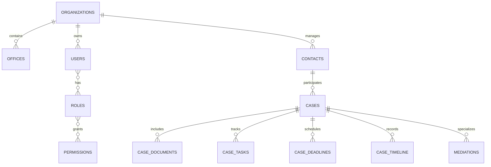

# ER Diagram

## Scopo
Questo documento conterra' la rappresentazione delle principali entita' dati e delle relazioni del sistema.

## Diagramma logico iniziale

## Note
Il diagramma deve essere aggiornato quando vengono introdotte nuove relazioni strutturali o quando un modulo verticale aggiunge entita' persistenti rilevanti.
